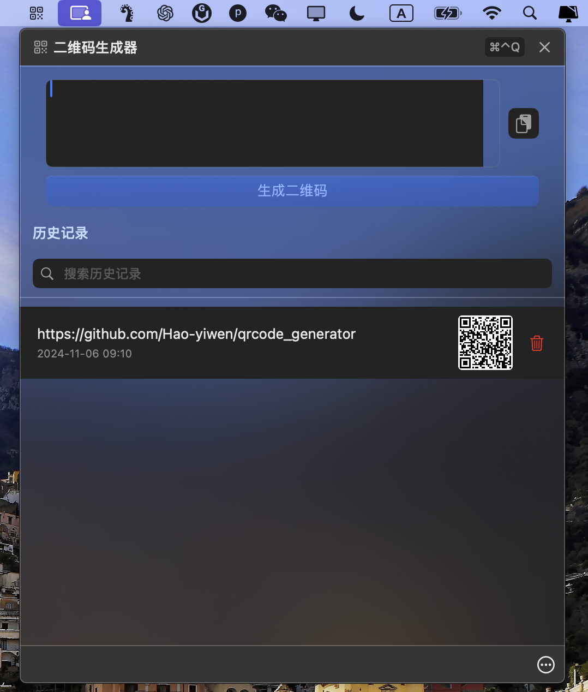

# qrcode_generator


一个简单的二维码生成器应用，运行在 macOS 状态栏。

## 下载安装

[下载最新版本](https://github.com/Hao-yiwen/qrcode_generator/releases/)

## 功能特点：

- 快速生成二维码
- 支持历史记录
- 一键复制和删除
- 从剪切板快速复制
- 快速搜索
- 二维码放大预览

## 安装说明：

- 下载 QRCodeGenerator.dmg
- 打开 DMG 文件
- 将应用拖入 Applications 文件夹
- 首次运行时右键点击应用选择"打开"

## 常见问题

如果提示"无法打开应用程序"，请尝试：

1. 右键点击应用选择"打开"
2. 在系统设置的安全性与隐私中允许打开
3. 如果仍然无法打开，请在终端中运行：
```bash
xattr -cr /Applications/qrcode_generator.app
```

## 系统要求：

macOS 13.0 或更高版本

## 预览



## 支持我的工作
如果这个项目对你有帮助，可以请我喝杯咖啡 ☕️

<details>
<summary>
  
</summary>
<br>

</details>
